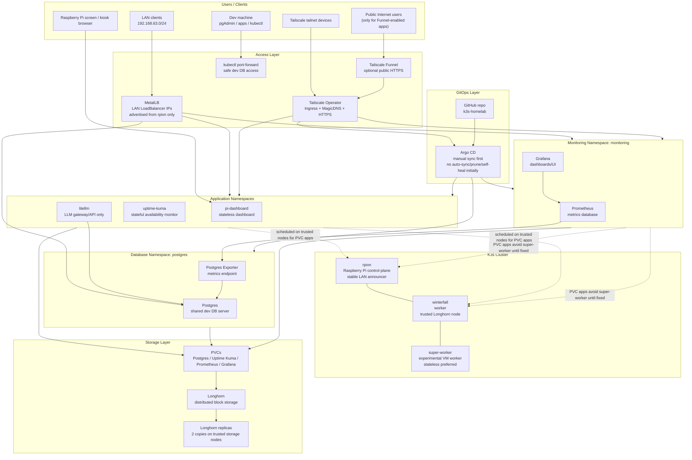
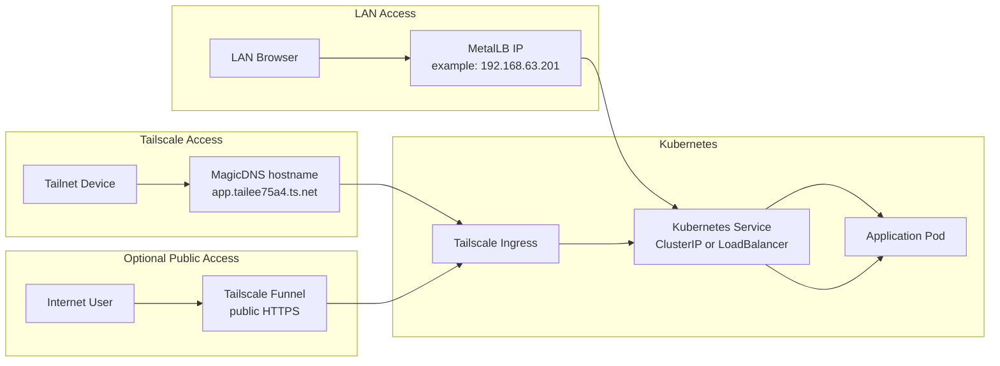
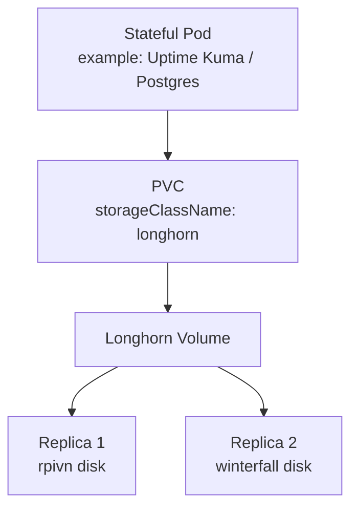
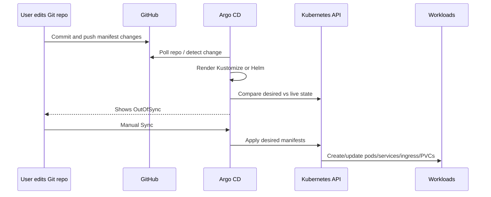

# Homelab K3s Platform

This README documents the current homelab Kubernetes setup, the technologies used, why they were chosen, how they connect together, and the main issues encountered during the build.

The cluster is designed around a small Raspberry Pi control-plane node plus worker nodes, with GitOps-style management through Argo CD, persistent storage through Longhorn, LAN LoadBalancer IPs through MetalLB, and remote access through Tailscale Ingress.

---

## 1. High-Level Architecture

The current design has moved from a single `litellm-stack` namespace into clearer platform/application layers:

```text
Application layer:
  pi-dashboard
  uptime-kuma
  litellm

Database layer:
  postgres namespace
  postgres exporter

Monitoring layer:
  monitoring namespace
  prometheus
  grafana

Platform layer:
  longhorn
  metallb
  tailscale operator
  argocd
```



Key idea:

```text
Longhorn = live replicated PVC storage
MetalLB = LAN LoadBalancer IPs
Tailscale = private HTTPS access and optional public Funnel
Argo CD = GitOps control plane
Postgres = shared dev database platform service
Prometheus/Grafana = shared monitoring platform service
LiteLLM = application that consumes Postgres, not owner of Postgres
```

---

## 2. Current Node Roles

| Node | Role | Notes |
|---|---|---|
| `rpivn` | K3s control-plane, Raspberry Pi | Main control-plane node. Lightweight workloads can run here. |
| `winterfall` | Worker | Trusted worker and Longhorn storage node. Use DHCP reservation/static IP and avoid IP conflicts with client machines. |
| `super-worker` | Experimental worker | VirtualBox test worker. Longhorn attach can look healthy, but kubelet mount/format failed on this node. Prefer stateless workloads until the node-side storage issue is fixed. |

Recommended labels used in the cluster:

```bash
sudo kubectl label node rpivn storage=longhorn --overwrite
sudo kubectl label node winterfall storage=longhorn --overwrite

sudo kubectl label node rpivn node.longhorn.io/create-default-disk=true --overwrite
sudo kubectl label node winterfall node.longhorn.io/create-default-disk=true --overwrite
```

Do **not** label `super-worker` with `storage=longhorn` unless it is stable enough for persistent workloads.

---

## 3. Main Design Principles

### 3.1 Keep the Pi lightweight

The Raspberry Pi can run the cluster, but the setup avoids unnecessary background work:

- Argo CD runs in Pi-friendly mode.
- Optional Argo CD components such as Dex, notifications, and ApplicationSet can be disabled or scaled down.
- Prometheus and Grafana can be scaled down when not needed.
- Kiosk browser should use Chromium/Openbox instead of a heavy full desktop browser setup.

### 3.2 Use GitOps, but safely

Argo CD is used to manage manifests, but the first phase uses conservative options:

```text
Manual sync only
No auto-sync
No prune
No self-heal
Force off
```

This prevents Argo CD from deleting or overwriting resources accidentally while apps are being migrated gradually.

### 3.3 Treat stateful apps differently

Stateless apps can be replaced easily. Stateful apps need care because they depend on PVCs.

Stateful apps in this cluster:

- Uptime Kuma
- Postgres
- Prometheus
- Grafana
- Longhorn itself

Safe migration rules:

- Do not delete namespaces that contain important PVCs.
- Do not rename PVCs.
- Do not shrink PVC sizes.
- Do not change `storageClassName`.
- Do not scale SQLite-style apps like Uptime Kuma above 1 replica.
- Use `strategy.type: Recreate` for Uptime Kuma.

---

## 4. Networking Overview



### 4.1 MetalLB

MetalLB provides LAN LoadBalancer IPs for services.

Known service examples:

| App | Example LAN IP | Notes |
|---|---:|---|
| Uptime Kuma | `192.168.63.201` | Port 80 to pod port 3001 |
| Kubernetes Dashboard | `192.168.63.203` | Port 443 to pod port 8443 or Kong proxy, depending on version |
| Longhorn UI | `192.168.63.204` | Optional |
| LiteLLM | `192.168.63.205` | API/UI |
| Prometheus | `192.168.63.206` | Metrics UI |

MetalLB is useful for same-LAN access without NodePort.


### 4.1.1 Current MetalLB advertisement policy

A real issue occurred where MetalLB services were only partially reachable from LAN clients. The services existed and had `EXTERNAL-IP`s, but some IPs timed out from Windows/iPhone. The fix was to restrict L2 advertisement to the stable Raspberry Pi node, `rpivn`.

Current recommended L2Advertisement:

```yaml
apiVersion: metallb.io/v1beta1
kind: L2Advertisement
metadata:
  name: homelab-l2
  namespace: metallb-system
spec:
  ipAddressPools:
    - default-pool
  nodeSelectors:
    - matchLabels:
        kubernetes.io/hostname: rpivn
```

This does not prevent speaker pods from running on other nodes. It only tells MetalLB which node is allowed to announce the LoadBalancer IPs on the LAN.

Why this matters:

```text
LAN client -> 192.168.63.x LoadBalancer IP
MetalLB L2 announcement should come from a stable, reachable LAN node
rpivn is stable
super-worker is experimental and should not advertise LAN VIPs for now
```

### 4.2 Tailscale Ingress

Tailscale Ingress provides HTTPS access using Tailscale hostnames.

Examples:

```text
https://pi-dashboard.tailee75a4.ts.net
https://uptime-kuma.tailee75a4.ts.net
https://litellm.tailee75a4.ts.net
https://prometheus.tailee75a4.ts.net
https://grafana.tailee75a4.ts.net
https://longhorn.tailee75a4.ts.net
https://argocd.tailee75a4.ts.net
```

A Tailscale Ingress hostname comes from:

```yaml
tls:
  - hosts:
      - app-name
```

This means Tailscale creates an HTTPS hostname like:

```text
https://app-name.<tailnet>.ts.net
```

### 4.3 Tailnet-only vs Funnel

Tailnet-only Ingress:

```yaml
apiVersion: networking.k8s.io/v1
kind: Ingress
metadata:
  name: app-tailnet
  namespace: app-namespace
spec:
  ingressClassName: tailscale
  defaultBackend:
    service:
      name: app-service
      port:
        number: 80
  tls:
    - hosts:
        - app-name
```

Public Funnel Ingress:

```yaml
apiVersion: networking.k8s.io/v1
kind: Ingress
metadata:
  name: app-funnel
  namespace: app-namespace
  annotations:
    tailscale.com/funnel: "true"
spec:
  ingressClassName: tailscale
  defaultBackend:
    service:
      name: app-service
      port:
        number: 80
  tls:
    - hosts:
        - app-name
```

Recommended access policy:

| Service | Recommended Access |
|---|---|
| pi-dashboard | Tailnet or Funnel, depending on sensitivity |
| Uptime Kuma | Tailnet-only preferred |
| Kubernetes Dashboard | Tailnet-only |
| Longhorn UI | Tailnet-only |
| Prometheus | Tailnet-only |
| Grafana | Tailnet-only |
| Argo CD | Tailnet-only |
| LiteLLM | Tailnet-only or carefully protected public access |

Public Funnel makes the service reachable from the internet. Tailscale ACLs protect tailnet access, but public Funnel needs app-level authentication because it is no longer limited to tailnet devices.

---

## 5. Storage Overview: Longhorn

Longhorn is used as the default distributed storage layer.



### 5.1 Important Longhorn Settings

Longhorn was installed with settings equivalent to:

```bash
helm install longhorn longhorn/longhorn \
  --namespace longhorn-system \
  --set persistence.defaultClassReplicaCount=2 \
  --set defaultSettings.createDefaultDiskLabeledNodes=true \
  --set defaultSettings.storageOverProvisioningPercentage=100
```

Meaning:

- New Longhorn volumes default to 2 replicas.
- Longhorn only creates default disks on nodes labeled with `node.longhorn.io/create-default-disk=true`.
- Storage over-provisioning is limited to 100%.

### 5.2 Replica Mental Model

A stateful app like Uptime Kuma should usually have:

```text
1 app pod
1 Kubernetes PVC
1 Longhorn volume
2 Longhorn storage replicas
```

Longhorn replicas are block-level storage copies. They are not the same as application replicas.

### 5.3 PVC Size Mental Model

A PVC request like:

```yaml
resources:
  requests:
    storage: 5Gi
```

means the volume’s logical requested capacity is 5Gi. Longhorn is thin-provisioned, so actual disk usage grows as data is written, but scheduling and safety calculations still use the requested size and replica count.

With 2 Longhorn replicas, a 5Gi volume needs enough capacity on two storage nodes.

### 5.4 Snapshots

Longhorn snapshots are point-in-time snapshots of a volume. They are not full copies at the beginning; they grow as blocks change.

Snapshots are not the same as external backups. For real disaster recovery, use Longhorn backup targets later.

---

## 6. GitOps with Argo CD

Argo CD watches Git and compares desired state with live Kubernetes state.



### 6.1 Sync Policy Used During Migration

For safety, applications are created without:

```yaml
syncPolicy:
  automated:
```

So Argo CD does not automatically sync.

Safe sync options:

```text
Prune: OFF
Force: OFF
Auto-create namespace: ON
Apply Only: optional
```

### 6.2 How Kustomize Works with Argo CD

If a folder has:

```text
apps/litellm-stack/
  01-secrets.yaml
  02-postgres.yaml
  03-postgres-exporter.yaml
  04-litellm-config.yaml
  05-litellm.yaml
  06-prometheus.yaml
  07-grafana.yaml
  kustomization.yaml
```

and `kustomization.yaml` contains:

```yaml
resources:
  - 01-secrets.yaml
  - 02-postgres.yaml
  - 03-postgres-exporter.yaml
```

then Argo CD only renders and applies those three files.

Later, adding more files to `kustomization.yaml` makes the app OutOfSync. Manual sync applies the new desired resources.

If a resource is removed from `kustomization.yaml`:

- With prune off, Argo CD does not delete it.
- With prune on, Argo CD may delete it.

During migration, keep prune off.

---

## 7. Applications

## 7.1 pi-dashboard

### Purpose

`pi-dashboard` is a lightweight dashboard app intended to be displayed on the Raspberry Pi screen, usually through a kiosk browser.

### Type

Stateless.

### Access

- Tailscale Ingress
- Optional LAN access through MetalLB
- Local Pi kiosk browser

### Notes

The Pi browser setup should avoid heavy desktop overhead. Chromium kiosk mode with a minimal X/Openbox setup is preferred over a full browser session.

Example kiosk launch pattern:

```bash
DISPLAY=:0 chromium --kiosk --app=http://<dashboard-url>
```

### Argo CD Migration

`pi-dashboard` was moved first because it is stateless and low-risk.

The app folder uses Kustomize:

```text
apps/pi-dashboard/
  namespace.yaml
  deployment.yaml
  service.yaml
  tailscale-ingress.yaml
  kustomization.yaml
```

The old Traefik ingress was intentionally excluded from `kustomization.yaml` if no longer needed.

---

## 7.2 Kubernetes Dashboard

### Purpose

Kubernetes Dashboard provides a web UI for Kubernetes cluster management.

### Type

Stateless.

### Access

Recommended:

```text
Tailnet-only Tailscale Ingress
```

Do not expose Kubernetes Dashboard through public Funnel.

### Migration Notes

The old install used:

```text
https://raw.githubusercontent.com/kubernetes/dashboard/v2.0.0-rc5/aio/deploy/recommended.yaml
```

That old manifest layout is very different from the newer Helm-based Dashboard.

The safer migration approach was:

```text
Delete the old kubernetes-dashboard namespace
Install the newer Helm-based Dashboard through Argo CD
Expose the new service through Tailscale Ingress
```

This avoids version mismatch and ownership conflicts.

### Argo CD Notes

The Dashboard Helm app can be managed by Argo CD, and a separate Argo CD app can manage custom extras like Tailscale Ingress.

Recommended split:

```text
Application 1: kubernetes-dashboard
  source: Helm chart

Application 2: kubernetes-dashboard-extras
  source: Git repo
  contains: Tailscale Ingress
```

### Login

For homelab use, an admin service account token can be generated:

```bash
sudo kubectl -n kubernetes-dashboard create token dashboard-admin
```

Be careful with cluster-admin tokens.

---

## 7.3 Uptime Kuma

### Purpose

Uptime Kuma monitors services and provides a status/alerting UI.

### Type

Stateful.

Uptime Kuma stores data under:

```text
/app/data
```

Usually this includes SQLite database files.

### Storage

Use Longhorn PVC.

Important rules:

```text
replicas: 1
strategy.type: Recreate
mountPath: /app/data
same PVC name
same PVC size or larger
storageClassName: longhorn
```

Example Deployment pattern:

```yaml
apiVersion: apps/v1
kind: Deployment
metadata:
  name: uptime-kuma
  namespace: uptime-kuma
spec:
  replicas: 1
  strategy:
    type: Recreate
  selector:
    matchLabels:
      app: uptime-kuma
  template:
    metadata:
      labels:
        app: uptime-kuma
    spec:
      nodeSelector:
        storage: longhorn
      containers:
        - name: uptime-kuma
          image: louislam/uptime-kuma:1
          ports:
            - name: http
              containerPort: 3001
          volumeMounts:
            - name: data
              mountPath: /app/data
      volumes:
        - name: data
          persistentVolumeClaim:
            claimName: uptime-kuma-data
```

### Access

- Tailscale tailnet-only recommended
- Optional MetalLB LAN IP, example `192.168.63.201`

### Argo CD Migration

Use adoption, not reinstall.

Safe steps:

1. Snapshot the Longhorn volume.
2. Put the same PVC name and deployment/service names in Git.
3. Create Argo CD Application.
4. Manual sync with prune off and force off.
5. Verify PVC remains Bound.

Do **not** delete the namespace or PVC during migration.

---

## 7.4 Decoupled Application / Database / Monitoring Layout

The original `litellm-stack` namespace mixed too many concerns:

```text
litellm-stack
  LiteLLM
  Postgres
  Postgres Exporter
  Prometheus
  Grafana
```

That worked for the first deployment, but it made the stack heavy and tightly coupled. The cleaner model is now:

```text
litellm namespace
  LiteLLM only

postgres namespace
  Postgres shared dev DB server
  Postgres Exporter

monitoring namespace
  Prometheus
  Grafana
```

Benefits:

```text
Postgres can serve multiple dev apps, not only LiteLLM
Monitoring becomes shared cluster monitoring
LiteLLM becomes easier to restart/redeploy without touching DB/monitoring
Prometheus can scrape LiteLLM, Postgres, Longhorn, Argo CD, etc.
Grafana can become the single dashboard layer
Argo CD apps are smaller and easier to debug
```

Tradeoffs:

```text
More namespaces and manifests
Cross-namespace service DNS must be correct
Secrets cannot be mounted across namespaces
Migration requires dump/restore or DB credential updates
```

Current recommended Argo CD split:

```text
Application: postgres
  path: apps/postgres
  manages Postgres, postgres-lb, postgres-exporter

Application: monitoring
  path: apps/monitoring
  manages Prometheus, Grafana, their PVCs/configs/ingresses

Application: litellm
  path: apps/litellm
  manages LiteLLM deployment/config/service/ingress only
```

Sync order:

```text
1. postgres
2. monitoring
3. litellm
```

---

## 7.5 Secrets After Decoupling

### Purpose

Secrets store:

- Postgres usernames/passwords
- LiteLLM `DATABASE_URL`
- LiteLLM master key and salt key
- LiteLLM UI credentials
- Postgres Exporter connection string
- Grafana admin credentials
- Prometheus scrape credentials for protected endpoints

### Namespace rule

Kubernetes Secrets are namespace-scoped. A pod can only mount/read a Secret from its own namespace.

Example:

```text
Prometheus pod namespace: monitoring
Secret namespace: litellm
Result: Prometheus cannot mount it
```

Correct decoupled pattern:

```text
litellm namespace:
  litellm-secret

monitoring namespace:
  litellm-metrics-secret
```

Both can contain the same LiteLLM master key value, but they are separate Kubernetes Secret objects.

### Secret updates and pod restarts

Argo CD updates Secrets and ConfigMaps, but it does not automatically restart pods unless the pod template changes.

For env-based Secrets:

```text
Secret updated
pod still has old env value
rollout restart required
```

Common restart commands:

```bash
sudo kubectl -n litellm rollout restart deploy/litellm
sudo kubectl -n postgres rollout restart deploy/postgres-exporter
sudo kubectl -n monitoring rollout restart statefulset/prometheus
sudo kubectl -n monitoring rollout restart deploy/grafana
```

Long-term options:

```text
Manual rollout restart after Argo sync
GitOps restart annotation bump
Stakater Reloader controller later
```

### Postgres Secret warning

Changing `POSTGRES_USER` / `POSTGRES_PASSWORD` in a Kubernetes Secret does **not** change an already-initialized Postgres database. Those values are used when the data directory is first initialized.

If the PVC already contains a database, change users/passwords inside Postgres with SQL:

```sql
ALTER USER old_user WITH PASSWORD 'new_password';
CREATE USER new_user WITH PASSWORD 'new_password';
GRANT ALL PRIVILEGES ON DATABASE litellm TO new_user;
```

Deleting the Postgres pod is not enough. The database state lives on the PVC.

For a full reset with no important data:

```text
scale StatefulSet to 0
remove/reset PVC or drop/recreate database
scale StatefulSet back to 1
```

Do not commit real secrets to a public GitHub repo. For a private homelab repo this is acceptable temporarily, but long-term use SOPS, SealedSecrets, or External Secrets.

---

## 7.6 Postgres as Shared Dev Database

### Purpose

Postgres is now treated as a reusable dev database server, not as a LiteLLM-only component.

Recommended namespace:

```text
postgres
```

Recommended service names:

```text
postgres.postgres.svc.cluster.local:5432
postgres-lb -> 192.168.63.201:5432 for LAN access
```

### Type

Stateful.

Use a StatefulSet with one replica for the simple homelab/dev setup:

```yaml
apiVersion: apps/v1
kind: StatefulSet
metadata:
  name: postgres
  namespace: postgres
spec:
  serviceName: postgres-headless
  replicas: 1
```

### Storage

Use Longhorn:

```yaml
volumeClaimTemplates:
  - metadata:
      name: data
    spec:
      accessModes:
        - ReadWriteOnce
      storageClassName: longhorn
      resources:
        requests:
          storage: 10Gi
```

Storage can be expanded later, but do not shrink PVCs in place.

### Resources

For a shared dev DB server, use more resources than the original LiteLLM-only DB:

```yaml
resources:
  requests:
    cpu: 250m
    memory: 512Mi
  limits:
    memory: 1536Mi
```

Adjust based on Pi pressure.

### Access methods

Preferred for development:

```bash
sudo kubectl -n postgres port-forward svc/postgres 5432:5432
```

Then pgAdmin connects to:

```text
host: 127.0.0.1
port: 5432
```

LAN access through MetalLB:

```text
host: 192.168.63.201
port: 5432
```

Do not expose Postgres through public Tailscale Funnel. Normal Kubernetes HTTP Ingress is not for raw Postgres TCP.

### LiteLLM connection after decoupling

LiteLLM must use the cross-namespace DNS name:

```text
postgresql://litellm:<password>@postgres.postgres.svc.cluster.local:5432/litellm
```

Do not use only `postgres:5432` unless Postgres is in the same namespace as LiteLLM.

---

## 7.7 Postgres Exporter

### Purpose

Postgres Exporter exposes Postgres metrics to Prometheus.

### Recommended namespace

Keep it with Postgres:

```text
postgres
```

Reason:

```text
It needs Postgres credentials
It represents the DB layer
Prometheus scrapes it cross-namespace
```

### Access

Internal only.

Prometheus target:

```text
postgres-exporter.postgres.svc.cluster.local:9187
```

### Secret pattern

Do not hardcode `DATA_SOURCE_NAME` in the Deployment. Use a Secret:

```yaml
apiVersion: v1
kind: Secret
metadata:
  name: postgres-exporter-secret
  namespace: postgres
type: Opaque
stringData:
  DATA_SOURCE_NAME: postgresql://exporter:<password>@postgres.postgres.svc.cluster.local:5432/postgres?sslmode=disable
```

Deployment:

```yaml
env:
  - name: DATA_SOURCE_NAME
    valueFrom:
      secretKeyRef:
        name: postgres-exporter-secret
        key: DATA_SOURCE_NAME
```

After updating this Secret, restart the exporter pod.

---

## 7.8 Prometheus

### Purpose

Prometheus scrapes and stores metrics for the cluster and apps.

### Recommended namespace

```text
monitoring
```

### Type

StatefulSet + Longhorn PVC.

Prometheus stores time-series data under:

```text
/prometheus
```

Using a StatefulSet is appropriate because it provides stable pod/PVC identity.

### Current scrape targets

Recommended initial targets:

```yaml
scrape_configs:
  - job_name: prometheus
    static_configs:
      - targets:
          - localhost:9090

  - job_name: postgres
    static_configs:
      - targets:
          - postgres-exporter.postgres.svc.cluster.local:9187

  - job_name: litellm
    metrics_path: /metrics
    authorization:
      credentials_file: /etc/prometheus/secrets/litellm/LITELLM_MASTER_KEY
    static_configs:
      - targets:
          - litellm.litellm.svc.cluster.local:4000
```

### ConfigMap / Secret / PVC model

For Prometheus specifically:

```text
ConfigMap = prometheus.yml scrape configuration
Secret = sensitive bearer token / LiteLLM master key
PVC = actual Prometheus time-series database
```

The pod wiring looks like:

```text
ConfigMap prometheus-config
  -> volume prometheus-config
  -> mounted at /etc/prometheus/prometheus.yml

Secret litellm-metrics-secret
  -> volume litellm-metrics-secret
  -> mounted at /etc/prometheus/secrets/litellm/LITELLM_MASTER_KEY

PVC data-prometheus-0
  -> mounted at /prometheus
```

After changing ConfigMap/Secret, restart Prometheus unless you add a config reloader.

### Pi-friendly resources

```yaml
resources:
  requests:
    cpu: 50m
    memory: 256Mi
  limits:
    memory: 768Mi
```

If OOMKilled, increase memory or reduce retention/scrape volume.

---

## 7.9 Grafana

### Purpose

Grafana provides dashboards and visualization on top of Prometheus.

### Recommended namespace

```text
monitoring
```

### Type

Stateful Deployment is acceptable.

Grafana is stateful because it stores data in:

```text
/var/lib/grafana
```

A single-replica Deployment with PVC is fine if it uses:

```yaml
spec:
  replicas: 1
  strategy:
    type: Recreate
```

### Storage

Longhorn PVC mounted at:

```text
/var/lib/grafana
```

### Permission Requirements

Grafana commonly needs:

```yaml
securityContext:
  runAsUser: 472
  runAsGroup: 472
  fsGroup: 472
```

If Grafana cannot write to `/var/lib/grafana`, check PVC permissions and the security context.

### Prometheus Data Source

Grafana can provision Prometheus automatically:

```yaml
url: http://prometheus.monitoring.svc.cluster.local:9090
```

### Access

Recommended:

```text
Tailnet-only Tailscale Ingress
Optional LAN MetalLB IP: 192.168.63.207
```

Avoid public Funnel unless authentication is strong and intentional.

---

## 7.10 LiteLLM After Decoupling

### Purpose

LiteLLM is the LLM gateway/API and should no longer own the database or monitoring stack.

Recommended namespace:

```text
litellm
```

### Database connection

Use Postgres in the `postgres` namespace:

```text
postgres.postgres.svc.cluster.local:5432
```

Example Secret:

```yaml
apiVersion: v1
kind: Secret
metadata:
  name: litellm-secret
  namespace: litellm
type: Opaque
stringData:
  DATABASE_URL: postgresql://litellm:<password>@postgres.postgres.svc.cluster.local:5432/litellm
  LITELLM_MASTER_KEY: sk-...
  LITELLM_SALT_KEY: ...
  UI_USERNAME: admin
  UI_PASSWORD: change-this-password
```

### Prisma migration note

`USE_PRISMA_MIGRATE=True` lets LiteLLM create/update database schema. It does not necessarily recreate UI/admin data if tables were manually deleted or the DB is in a partial state.

Cleaner DB reset if data does not matter:

```sql
DROP DATABASE litellm;
CREATE DATABASE litellm OWNER litellm;
```

Then restart LiteLLM and let migrations run.

### Startup resources/probes

LiteLLM can be heavy on the Pi. Keep generous startup probes and memory:

```yaml
resources:
  requests:
    cpu: 250m
    memory: 512Mi
  limits:
    memory: 1500Mi
```

Use a startup probe so migrations do not get killed too early.

---

## 8. Platform Components

## 8.1 MetalLB

### Purpose

MetalLB gives Kubernetes `LoadBalancer` services real LAN IP addresses.

Without MetalLB, a bare-metal K3s cluster does not automatically get cloud LoadBalancer IPs.

### Pros

- Simple LAN access.
- Works well for homelab.
- Avoids NodePort URLs.

### Cons

- LAN-only unless combined with routing/VPN.
- IP pool must not conflict with DHCP.
- L2 mode depends on local network behavior.

### Recommended Argo CD Management

Separate installation from configuration:

```text
Application: metallb
  manages MetalLB Helm chart

Application: metallb-config
  manages IPAddressPool and L2Advertisement
```

This allows changing IP pools without touching the MetalLB controller install.

Example config:

```yaml
apiVersion: metallb.io/v1beta1
kind: IPAddressPool
metadata:
  name: homelab-pool
  namespace: metallb-system
spec:
  addresses:
    - 192.168.63.200-192.168.63.210
---
apiVersion: metallb.io/v1beta1
kind: L2Advertisement
metadata:
  name: homelab-l2
  namespace: metallb-system
spec:
  ipAddressPools:
    - homelab-pool
```

---

## 8.2 Longhorn

### Purpose

Longhorn provides persistent distributed block storage for Kubernetes PVCs.

### Pros

- Works well on bare-metal.
- Gives UI for volumes, replicas, snapshots, and recovery.
- Replicates storage across nodes.
- Easy to use through Kubernetes PVCs.

### Cons

- Resource-heavy for small devices.
- Requires stable disks and stable networking.
- CSI/engine issues can block pod mounts.
- Time sync problems can break webhook certificates.
- Needs careful upgrades and uninstall procedures.

### Important Operational Notes

Longhorn should be healthy before deploying stateful apps.

Check:

```bash
sudo kubectl -n longhorn-system get pods -o wide
sudo kubectl get sc
sudo kubectl -n longhorn-system get volumes.longhorn.io
```

### Recommended Argo CD Management

Move Longhorn to Argo CD late, not early.

Rules:

```text
Use the same Helm chart version as the current install
Use the same values
Manual sync only
Prune off
Force off
Do not delete the Longhorn Argo CD app casually
```

Values to preserve:

```yaml
persistence:
  defaultClassReplicaCount: 2

defaultSettings:
  createDefaultDiskLabeledNodes: true
  storageOverProvisioningPercentage: 100

preUpgradeChecker:
  jobEnabled: false
```

---

## 8.3 Tailscale Operator

### Purpose

The Tailscale Operator creates Tailscale proxy devices for Kubernetes Services/Ingresses and provides HTTPS hostnames through MagicDNS.

### Pros

- Very convenient remote access.
- No router port-forwarding needed.
- Tailnet-only access is safer for admin tools.
- Funnel can expose selected services publicly.

### Cons

- Requires correct OAuth/tag setup.
- Hostname conflicts can create `-1` suffixes.
- Public Funnel needs app-level auth.
- Ingress service port must match the Kubernetes Service port, not always the container port.

### Tag Model Used

Important tag separation:

```text
tag:k8s-operator
  for the operator itself

tag:k8s
  for proxy devices/services created by the operator
```

Normal machines like `rpivn` or `winterfall` should not be tagged as `tag:k8s-operator`.

---

## 8.4 Argo CD

### Purpose

Argo CD is the GitOps controller. It watches Git and applies Kubernetes desired state.

### Pros

- Git becomes the source of truth.
- Easy to see drift.
- Easy rollback by reverting Git commits.
- Works with Kustomize, raw YAML, and Helm.
- Manual sync mode is safe for learning.

### Cons

- Can delete resources if prune is enabled incorrectly.
- Can undo manual scale-down if self-heal is enabled.
- Adds its own resource usage.
- Managing Argo CD with Argo CD is possible but more complex.

### Pi-Friendly Argo CD

Recommended reduced mode:

```yaml
dex:
  enabled: false

notifications:
  enabled: false

applicationSet:
  replicas: 0

configs:
  cm:
    timeout.reconciliation: 15m
    timeout.reconciliation.jitter: 5m
  params:
    server.insecure: "true"

global:
  nodeSelector:
    kubernetes.io/hostname: rpivn
```

### Why `server.insecure: "true"`?

Tailscale Ingress terminates HTTPS externally. Argo CD can serve HTTP internally behind that HTTPS proxy.

### Managing Argo CD with Argo CD

Possible, but should be done last.

Bootstrap pattern:

```text
1. Install Argo CD manually
2. Create an Argo CD Application for Argo CD itself
3. Use manual sync
4. Avoid auto-prune/self-heal until stable
```

---

## 9. Major Obstacles and Fixes

## 9.1 Helm/Argo CD Install Timeout

### Symptom

During Argo CD Helm install:

```text
http2: client connection lost
TLS handshake timeout
context deadline exceeded
failed to create resource ... Kind=Role
```

### Root Cause

The Kubernetes API server on the Pi was overloaded or slow. The `Kind=Role` message referred to a Kubernetes RBAC Role, not a node role label.

### Fix

- Clean up failed Helm release.
- Use Pi-friendly Helm values.
- Pin Argo CD pods to `rpivn`.
- Disable optional components.
- Increase timeout.
- Scale down heavy workloads temporarily.

Example:

```bash
helm upgrade --install argocd argo/argo-cd \
  -n argocd \
  -f argocd-pi-values.yaml \
  --timeout 60m \
  --wait
```

---

## 9.2 Longhorn Disks Not Available

### Symptom

Longhorn volumes could not schedule because disks were unavailable or nodes were not configured for default disks.

### Root Cause

Longhorn was installed with:

```yaml
createDefaultDiskLabeledNodes: true
```

so Longhorn only auto-created disks on labeled nodes.

### Fix

Label trusted storage nodes:

```bash
sudo kubectl label node rpivn node.longhorn.io/create-default-disk=true --overwrite
sudo kubectl label node winterfall node.longhorn.io/create-default-disk=true --overwrite
```

Create disk path if needed:

```bash
sudo mkdir -p /var/lib/longhorn
```

---

## 9.3 Longhorn Webhook TLS / Time Sync Problem

### Symptom

Errors like:

```text
x509: certificate has expired or is not yet valid
current time is before certificate validity
```

### Root Cause

Node clocks were not in sync. Certificate validation failed because the node time was wrong.

### Fix

- Fix time sync on nodes.
- Restart Longhorn components.
- Recreate Longhorn webhook secrets if necessary.

Relevant cleanup used before:

```bash
sudo kubectl -n longhorn-system delete secret longhorn-webhook-ca longhorn-webhook-tls
sudo kubectl -n longhorn-system rollout restart deploy/longhorn-manager
```

---

## 9.4 Longhorn CSI/Mount Issues on `super-worker`

### Symptoms

```text
driver name driver.longhorn.io not found in registered CSI drivers
mkfs.ext4: Input/output error while writing out and closing file system
```

### Root Cause

The new worker did not have Longhorn CSI fully ready, or the VM/storage stack was not stable.

### Fixes Checked

Install required packages:

```bash
sudo apt install -y open-iscsi nfs-common
sudo systemctl enable --now iscsid
sudo systemctl restart k3s-agent
```

Check CSI node registration:

```bash
sudo kubectl get csinode super-worker -o yaml | grep -A20 driver.longhorn.io
sudo kubectl -n longhorn-system get pods -o wide | grep super-worker
```

### Policy

Keep stateful Longhorn-backed workloads on trusted nodes only:

```yaml
nodeSelector:
  storage: longhorn
```

---

## 9.5 Tailscale Operator OAuth/Tag Problem

### Symptom

Tailscale operator log showed:

```text
creating operator authkey: calling actor does not have enough permissions (403)
```

### Root Cause

The operator needs OAuth client credentials and proper tag ownership. A normal auth key or wrong tag configuration is not enough.

### Fix

Use proper OAuth credentials and tag ownership.

Conceptual tag model:

```json
{
  "tagOwners": {
    "tag:k8s-operator": [],
    "tag:k8s": ["tag:k8s-operator"]
  }
}
```

Only the Tailscale operator device should have `tag:k8s-operator`. Proxy devices should get `tag:k8s`.

---

## 9.6 Tailscale Ingress 502

### Symptom

Uptime Kuma through Tailscale Ingress returned 502.

### Root Cause

Ingress pointed to the wrong service port. It used the container port `3001` instead of the Kubernetes Service port `80`.

### Fix

Point Ingress to the Service port:

```yaml
defaultBackend:
  service:
    name: uptime-kuma
    port:
      number: 80
```

Important rule:

```text
Ingress backend port = Kubernetes Service port
not necessarily the container port
```

---

## 9.7 Tailscale Hostname Suffix `-1`

### Symptom

Dashboard hostname became:

```text
k8s-dashboard-1.tailee75a4.ts.net
```

### Root Cause

A stale or existing Tailscale machine already used the hostname.

### Fix

Remove the old Tailscale device from the admin console or use the new hostname.

---

## 9.8 LiteLLM OOM / Slow Startup

### Symptoms

- LiteLLM crashed or restarted during startup.
- Liveness probe killed it too early.
- Prisma migrations took time.

### Root Cause

LiteLLM was heavier than expected on the Pi, and startup probes were not forgiving enough.

### Fix

Increase memory and add a startup probe.

Recommended pattern:

```yaml
resources:
  requests:
    cpu: 250m
    memory: 512Mi
  limits:
    memory: 1500Mi

startupProbe:
  tcpSocket:
    port: http
  initialDelaySeconds: 30
  periodSeconds: 10
  timeoutSeconds: 5
  failureThreshold: 120

readinessProbe:
  httpGet:
    path: /health/readiness
    port: http
  initialDelaySeconds: 10
  periodSeconds: 10
  timeoutSeconds: 10
  failureThreshold: 12

livenessProbe:
  tcpSocket:
    port: http
  initialDelaySeconds: 30
  periodSeconds: 20
  timeoutSeconds: 5
  failureThreshold: 6
```

Keep:

```text
USE_PRISMA_MIGRATE=True
```

This lets LiteLLM manage DB schema migrations.

---

## 9.9 Prometheus Could Not Scrape LiteLLM Metrics

### Symptom

Prometheus got unauthorized responses from LiteLLM `/metrics`.

### Root Cause

LiteLLM metrics endpoint required the master key.

### Fix

Mount the LiteLLM Secret into Prometheus and use bearer authorization:

```yaml
authorization:
  credentials_file: /etc/prometheus/secrets/litellm/LITELLM_MASTER_KEY
```

---

## 9.10 PVC Shrinking

### Problem

PVCs can be expanded but usually cannot be shrunk directly.

### Fix

For disposable data like fresh Prometheus data, it is acceptable to delete and recreate the PVC.

For important data like Postgres or Uptime Kuma, do not shrink in place. Instead:

```text
backup/export
create new smaller PVC
restore/migrate data
```

---


## 9.11 Decoupling `litellm-stack`

### Problem

The original `litellm-stack` namespace included LiteLLM, Postgres, Postgres Exporter, Prometheus, and Grafana. This made it convenient at first, but it became heavy and tightly coupled.

### Fix

Split into dedicated namespaces:

```text
postgres:
  Postgres
  Postgres Exporter

monitoring:
  Prometheus
  Grafana

litellm:
  LiteLLM only
```

### Notes

This required changing LiteLLM DB host from same-namespace short DNS:

```text
postgres:5432
```

to cross-namespace DNS:

```text
postgres.postgres.svc.cluster.local:5432
```

If LiteLLM logs show:

```text
P1001: Can't reach database server at `postgres`:`5432`
```

then the database hostname is probably still wrong for the new namespace layout.

---

## 9.12 Secret Updates Do Not Automatically Restart Pods

### Problem

After updating LiteLLM or Postgres Exporter Secrets, dashboards still showed old environment values.

### Root Cause

Environment variables from Secrets are loaded when the container starts. Updating the Secret object does not update env vars inside existing containers.

### Fix

After Argo CD syncs the Secret, restart affected workloads:

```bash
sudo kubectl -n litellm rollout restart deploy/litellm
sudo kubectl -n postgres rollout restart deploy/postgres-exporter
sudo kubectl -n monitoring rollout restart statefulset/prometheus
```

Long-term alternatives:

```text
Bump restart annotation in Git
Use a reloader controller later
```

---

## 9.13 MetalLB Advertisement from Unstable Node

### Symptom

Some MetalLB LoadBalancer IPs worked from Windows while others timed out. The services and endpoints looked correct. Postgres service had a valid endpoint, but Windows could not reach `192.168.63.201:5432`.

### Root Cause

MetalLB L2 advertisement was allowed from multiple nodes, including `super-worker`. The experimental VM node was not a reliable LAN announcer.

### Fix

Restrict L2Advertisement to `rpivn` only:

```yaml
apiVersion: metallb.io/v1beta1
kind: L2Advertisement
metadata:
  name: homelab-l2
  namespace: metallb-system
spec:
  ipAddressPools:
    - default-pool
  nodeSelectors:
    - matchLabels:
        kubernetes.io/hostname: rpivn
```

Then clear ARP on Windows:

```powershell
arp -d *
```

After this, LAN LoadBalancer access became stable.

---

## 9.14 Argo CD LoadBalancer Had Wrong Selector

### Symptom

Internal Uptime Kuma check succeeded:

```text
http://argocd-server.argocd.svc.cluster.local/
```

but LAN access through:

```text
http://192.168.63.203/
```

failed.

### Root Cause

The custom `argocd-lb` Service had no endpoints because the selector was wrong:

```yaml
selector:
  app: argocd-server
```

The real Argo CD server pods use Helm labels:

```yaml
app.kubernetes.io/instance: argocd
app.kubernetes.io/name: argocd-server
```

### Fix

```yaml
apiVersion: v1
kind: Service
metadata:
  name: argocd-lb
  namespace: argocd
spec:
  type: LoadBalancer
  loadBalancerIP: 192.168.63.203
  externalTrafficPolicy: Cluster
  selector:
    app.kubernetes.io/instance: argocd
    app.kubernetes.io/name: argocd-server
  ports:
    - name: http
      port: 80
      targetPort: 8080
      protocol: TCP
```

Verify:

```bash
sudo kubectl -n argocd get endpoints argocd-lb -o wide
```

Expected endpoint:

```text
10.42.x.x:8080
```

---

## 9.15 Stateful Deployments vs StatefulSets

### Clarification

Stateful app does not always mean Kubernetes StatefulSet.

Current pattern:

```text
Postgres: StatefulSet + PVC
Prometheus: StatefulSet + PVC
Grafana: Deployment + PVC + Recreate
Uptime Kuma: Deployment + PVC + Recreate
```

Grafana and Uptime Kuma are still stateful because they store data on PVCs, even though they use Deployments.

Important rules for stateful Deployments:

```yaml
spec:
  replicas: 1
  strategy:
    type: Recreate
```

This avoids two pods trying to use a ReadWriteOnce PVC during rollout.

---

## 10. Pros and Cons of This Setup

## Pros

- Full homelab Kubernetes platform.
- GitOps through Argo CD.
- Remote HTTPS access without router port forwarding through Tailscale.
- LAN LoadBalancer services through MetalLB.
- Persistent replicated storage through Longhorn.
- Good observability path with Prometheus + Grafana.
- LiteLLM gets a real Postgres backend, now decoupled into a shared `postgres` namespace.
- Apps can be migrated gradually.
- Manual sync makes Argo CD safer while learning.

## Cons

- Heavy stack for a Raspberry Pi.
- Longhorn consumes noticeable CPU/RAM and requires stable nodes.
- Prometheus/Grafana can become resource-heavy, but they are now isolated in `monitoring` and can be scaled independently.
- Argo CD adds another controller to maintain.
- Public Funnel can expose apps if used carelessly.
- Secrets in Git need a better long-term solution.
- SQLite apps like Uptime Kuma should not be scaled horizontally.
- Managing platform apps through Argo CD requires caution.

---

## 11. Recommended Argo CD Migration / Management Order

Current and recommended order:

```text
1. pi-dashboard
   stateless and low-risk

2. Kubernetes Dashboard / Headlamp-related extras
   stateless admin UI path

3. Uptime Kuma
   stateful Deployment with PVC
   replicas=1 and strategy=Recreate

4. Split old litellm-stack into layers:
   a. postgres namespace
      - Postgres StatefulSet
      - postgres-lb
      - Postgres Exporter

   b. monitoring namespace
      - Prometheus StatefulSet
      - Grafana Deployment
      - Prometheus config/secrets

   c. litellm namespace
      - LiteLLM Secret/ConfigMap
      - LiteLLM Deployment/Service/Ingress
      - DB URL points to postgres.postgres.svc.cluster.local

5. MetalLB config
   - IPAddressPool
   - L2Advertisement restricted to rpivn

6. Tailscale Ingress extras

7. MetalLB Helm install

8. Longhorn Helm install
   use same chart version first
   keep prune off

9. Argo CD manages Argo CD itself
   do this last
```

Platform components should be moved later because other apps depend on them.

For all stateful/platform apps, keep:

```text
Manual sync
Prune OFF
Force OFF
Self-heal OFF
Auto-sync OFF until stable
```

---

## 12. Recommended Repository Structure

Current recommended structure after decoupling:

```text
k3s-homelab/
  apps/
    pi-dashboard/
      namespace.yaml
      deployment.yaml
      service.yaml
      service-lb.yaml
      tailscale-ingress.yaml
      kustomization.yaml

    uptime-kuma/
      namespace.yaml
      pvc.yaml
      deployment.yaml
      service.yaml
      service-lb.yaml
      tailscale-ingress.yaml
      kustomization.yaml

    postgres/
      namespace.yaml
      secret.yaml
      service.yaml
      service-lb.yaml
      statefulset.yaml
      postgres-exporter-secret.yaml
      postgres-exporter.yaml
      kustomization.yaml

    monitoring/
      namespace.yaml
      prometheus-config.yaml
      prometheus-secret-litellm-metrics.yaml
      prometheus.yaml
      prometheus-lb.yaml
      grafana-secret.yaml
      grafana-datasources.yaml
      grafana.yaml
      grafana-lb.yaml
      grafana-ingress.yaml
      kustomization.yaml

    litellm/
      namespace.yaml
      secret.yaml
      config.yaml
      deployment.yaml
      service.yaml
      service-lb.yaml
      tailscale-ingress.yaml
      kustomization.yaml

  platform/
    metallb-config/
      ipaddresspool.yaml
      l2advertisement.yaml
      kustomization.yaml

    argocd/
      argocd-app.yaml
      argocd-lb.yaml
      argocd-tailnet-ingress.yaml
      kustomization.yaml

    longhorn/
      longhorn-app.yaml
      longhorn-lb.yaml
      longhorn-tailnet-ingress.yaml

  argocd-apps/
    pi-dashboard.yaml
    uptime-kuma.yaml
    postgres.yaml
    monitoring.yaml
    litellm.yaml
    metallb-config.yaml
    argocd-platform.yaml
    longhorn.yaml
```

Later, `argocd-apps/` can be managed by a root Argo CD app, often called an app-of-apps pattern.

Important naming rule:

```text
Do not keep platform services hidden inside app-specific namespaces.
Postgres belongs to postgres.
Prometheus/Grafana belong to monitoring.
LiteLLM belongs to litellm.
```

---

## 13. Useful Commands

### Cluster

```bash
sudo kubectl get nodes -o wide
sudo kubectl get pods -A -o wide
sudo kubectl get sc
```

### Argo CD

```bash
sudo kubectl -n argocd get pods -o wide
sudo kubectl -n argocd get applications
```

### Longhorn

```bash
sudo kubectl -n longhorn-system get pods -o wide
sudo kubectl -n longhorn-system get svc
```

### PVCs

```bash
sudo kubectl get pvc -A
```

### MetalLB

```bash
sudo kubectl -n metallb-system get pods -o wide
sudo kubectl -n metallb-system get ipaddresspool,l2advertisement
```

### Tailscale Ingresses

```bash
sudo kubectl get ingress -A -o wide
```

### Postgres

```bash
sudo kubectl -n postgres get pod,pvc,svc,endpoints -o wide
sudo kubectl -n postgres logs statefulset/postgres --tail=100
sudo kubectl -n postgres logs deploy/postgres-exporter --tail=100
sudo kubectl -n postgres port-forward svc/postgres 5432:5432
```

### Monitoring

```bash
sudo kubectl -n monitoring get pod,pvc,svc,ingress -o wide
sudo kubectl -n monitoring logs statefulset/prometheus --tail=100
sudo kubectl -n monitoring logs deploy/grafana --tail=100
sudo kubectl -n monitoring rollout restart statefulset/prometheus
sudo kubectl -n monitoring rollout restart deploy/grafana
```

### LiteLLM

```bash
sudo kubectl -n litellm get pod,svc,ingress -o wide
sudo kubectl -n litellm logs deploy/litellm --tail=100
sudo kubectl -n litellm exec deploy/litellm -- printenv DATABASE_URL
sudo kubectl -n litellm rollout restart deploy/litellm
```

---

## 14. Safety Checklist Before Syncing Stateful Apps

Before syncing Uptime Kuma, Postgres, Prometheus, or Grafana:

```text
[ ] Longhorn UI is healthy
[ ] PVC name matches existing PVC
[ ] PVC size is same or larger
[ ] storageClassName is longhorn
[ ] cross-namespace service DNS is correct, for example postgres.postgres.svc.cluster.local
[ ] Secrets exist in the same namespace as the pod that consumes them
[ ] app replicas are correct
[ ] no accidental namespace delete
[ ] prune is off
[ ] force is off
[ ] self-heal is off
[ ] snapshot exists if data matters
```

---

## 15. Future Improvements

Good next steps:

- Move secrets to SOPS or SealedSecrets.
- Add Longhorn backup target.
- Add resource limits to every workload.
- Add Prometheus retention limits.
- Add Grafana dashboards as code.
- Add alerting later.
- Use Argo CD app-of-apps after all apps are stable.
- Add HA control-plane only if more reliable hardware is available.
- Restrict admin UIs to tailnet-only access.
- Keep public Funnel only for intentionally public services.
