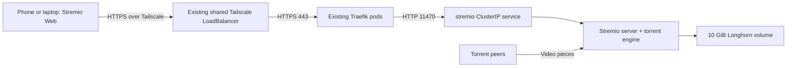

# Stremio streaming server

The official `stremio/server` image includes the streaming service, BitTorrent
engine and FFmpeg. One replica provides the backend; use Stremio Web as the UI.
The server downloads torrent pieces on the cluster and sends video over HTTPS
to your browser. Seeking requests the relevant part of the video.



## Review and deployment

Files follow the repository's numbered manifest/Kustomize/Argo CD structure.
`argocd-app.yaml` is separate and has no automatic sync. Do not register it
against `main` before these files are committed and pushed: Argo CD cannot
deploy uncommitted local files. A review deployment uses only this directory:

```powershell
kubectl kustomize apps/stremio
kubectl apply --dry-run=server -k apps/stremio
kubectl apply -k apps/stremio
kubectl -n stremio rollout status deployment/stremio --timeout=180s
kubectl -n stremio get pvc,pods,service,ingress
kubectl -n kube-system get service traefik-tailscale-ha
```

## Phone and laptop connection

This follows the current apps: the existing `kube-system/traefik-tailscale-ha`
LoadBalancer forwards HTTPS traffic to Traefik. A host-based Traefik ingress
routes `stremio.lab` to this app's ClusterIP service on port 11470.
No dedicated Tailscale proxy or separate Tailscale service is created.

1. Connect the phone/laptop to your existing tailnet, including away from home.
2. Add a DNS record for `stremio.lab` pointing to the existing shared Traefik
   Tailscale LoadBalancer address, using the same DNS setup as `grafana.lab`.
   Obtain its current address from the Service; do not assume an old IP.
3. Ensure the client uses that DNS resolver and can reach the shared LB on 443
   under your Tailscale access policy.
4. Trust the existing homelab root CA on the client. On iPhone, install the CA
   certificate profile, then enable full trust under Settings -> General ->
   About -> Certificate Trust Settings. Merely accepting a browser warning
   does not establish trust for Stremio Web's API/video requests.
5. Open https://stremio.lab/settings in Safari and verify it returns JSON
   without a certificate warning before testing Stremio Web.
6. Open https://web.stremio.com/ and sign into your Stremio account.
7. In Settings -> Streaming -> Add URL, enter `https://stremio.lab/`, select it,
   confirm Online, then test playback and seeking.

The endpoint is the streaming backend, not a movie-browsing UI.
No laptop desktop service is required. cert-manager uses the existing
`homelab-ca` issuer for `stremio-lab-tls`; this certificate is NOT publicly
trusted by default. Client DNS and CA trust are prerequisites outside these
app manifests. No public Funnel, NodePort or router forwarding is added.
Tailscale policy remains the access boundary for the shared LB; Stremio login
is not authentication for the server API. If you expose the shared Traefik
externally by another route, that route must be restricted separately.

## Storage and playback

The 10 GiB Longhorn PVC retains server settings/cache across pod restarts.
Recreate prevents simultaneous replicas from sharing a ReadWriteOnce volume.
Choose a cache budget below the volume capacity using the connected client's
Streaming settings. A cache setting is not a hard disk quota: large files or
concurrent streams can exceed it. Monitor disk space; enlarge the PVC before
streaming files that approach its capacity. Review Longhorn's free capacity
and replica overhead before deployment.

The upstream image currently uses its default root home. Linux capabilities
are dropped, privilege escalation is disabled, and no Kubernetes token is
mounted. An upstream non-root image would need a separately tested migration.

The image is pinned as `stremio/server:v4.22.0@sha256:30829e739e6336811830f87c3d725eb5f14169f94f54725c907f42275a3bda27` with IfNotPresent pulls. The immutable multi-architecture index supports linux/amd64, linux/arm64 and linux/arm/v7.
Software transcoding is constrained by the CPU/memory limits; no GPU is mapped.
Safari's codec/container support can differ from desktop playback. Test an
H.264/AAC source first. A server Online status proves connectivity, not video
compatibility. HEVC/MKV may need a compatible transcode profile; do not assume
every source works on iPhone.

Ingress NetworkPolicy accepts only the existing Traefik pods in kube-system.
No egress policy is imposed because DNS, trackers and peers use dynamic ports.
Cluster-wide firewall policies may still restrict them. Torrent traffic uses
the cluster's normal internet egress, not automatically a Tailscale exit node.
No inbound peer port is mapped; outbound peer connections can still download,
but peer reachability may be reduced. Playback still depends on available peers.

## Verification and troubleshooting

From a tailnet-connected device, test `https://stremio.lab/settings` for a JSON
response, then verify the browser itself can connect (including CORS):

```powershell
curl.exe -i -H "Origin: https://web.stremio.com" https://stremio.lab/settings
kubectl -n stremio logs deployment/stremio --tail=100
kubectl -n stremio describe ingress stremio
kubectl -n kube-system get service traefik-tailscale-ha
```

Keep upstream CORS checks enabled (`NO_CORS` is not set). If the official Web
origin is rejected, inspect the actual server response before changing policy;
CORS is not authentication. Check Tailscale ACLs, Traefik routing, DNS, CA trust,
PVC binding, image pull/architecture and node resources if rollout fails.

Official references:
- https://github.com/Stremio/server-docker
- https://github.com/Stremio/stremio-service
- https://tailscale.com/docs/kubernetes-operator/ingress

Validation of YAML or a server dry-run does not prove torrent streaming,
Safari playback, or seeking. Verify those from the target device after rollout.

## Review validation (2026-10-04)

- `kubectl kustomize apps/stremio` rendered the six workload resources successfully.
- The official image manifest advertised linux/amd64, linux/arm64 and linux/arm/v7.
- Cluster status inspection timed out connecting to `192.168.63.69:6443`.
- Server-side dry-run, rollout, TLS certificate issuance and iPhone playback remain
  unverified. No cluster resources were applied and no Git commit was made.

### Probe verification for server 4.22.0

Startup, readiness and liveness use HTTP GET `/heartbeat` on named port `http`
(container TCP 11470). The official release bundle explicitly registers that
route and immediately returns HTTP 200, content-type application/json, body
`{"success":true}`. `/settings` also exists, but calls cache.getOptions; it is
retained for client connection troubleshooting, not used as a health probe.
These probes test the HTTP event loop; they do not prove peer availability,
FFmpeg compatibility, disk capacity or a successful stream.

Source inspected: https://dl.strem.io/server/v4.22.0/desktop/server.js
Bundle SHA256: `81ea888b9508dbb8ec6598f788ae4b834fdfdf1657e4c889d84543126e0da173`.
The bundle declares package version `4.22.0`.
The official 4.22.0 bundle was executed locally with Node.js: GET /heartbeat returned HTTP 200 and {"success":true}; /settings reported serverVersion 4.22.0. The temporary process was stopped after testing. This verifies the HTTP handler, not the Linux container or Kubernetes rollout. Docker was unavailable; local transcoding checks also failed because FFmpeg was absent.